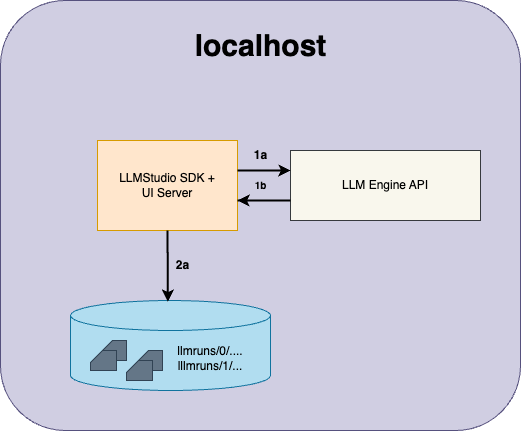
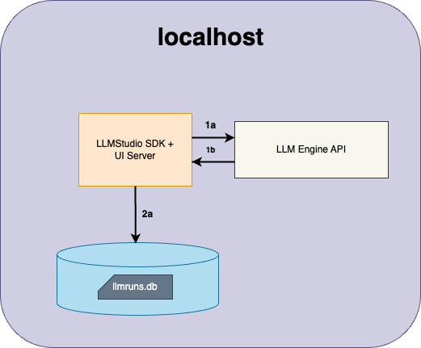
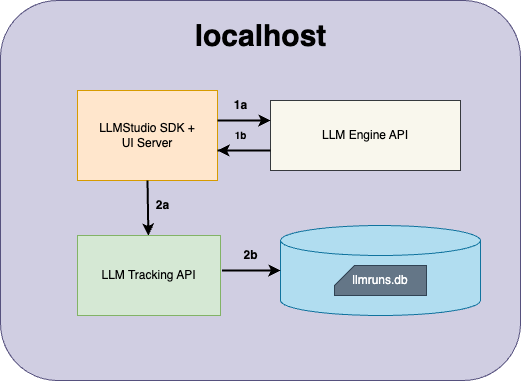
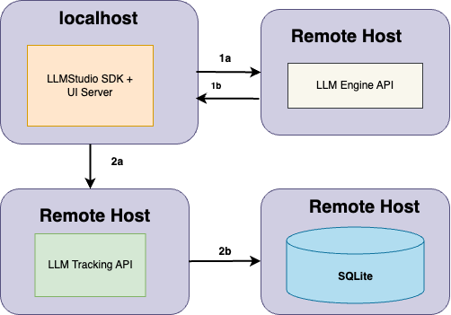

```

```

# LLMStudio Architecture Roadmap

LLMStudio is a versatile platform designed to be the interface between users and multiple LLM providers. The platform is engineered to simplify logging, progress tracking, and the iterative improvement of machine learning projects. This is facilitated through Python APIs.

> **Note**: This is a roadmap and we're open to suggestions. If you have any, please feel free to discuss them in the [relevant issue thread](https://github.com/TensorOpsAI/LLMstudio/issues/14).
## Table of Concepts

- [Concepts](#concepts)
  - [LLM Engine API](#llm-engine-api)
  - [LLM Tracking API](#llm-tracking-api)
  - [Logging Information](#logging-information)
- [Where Runs are Recorded](#where-runs-are-recorded)
- [How LLMStudio Interactions are Logged](#how-llmstudio-interactions-are-logged)

## Concepts

### LLM Engine API

The LLM Engine API is a critical component of LLMStudio, designed to mediate interactions between the LLMStudio client and the providers. It handles REST API requests, receives data from the providers, and forwards this information to the LLMStudio client. It is involved in all three scenarios and plays a central role in executing and logging runs.

### LLM Tracking API

The LLM Tracking API specializes in advanced logging scenarios, offering a heightened level of flexibility and control. It provides robust features for arranging logs and system settings based on distinct projects and sessions. This granular approach enables users to manage complex logging requirements more efficiently. Particularly useful when intricate or multi-layered tracking is needed, the API allows for a seamless integration into various storage backends, be it a local FileStore or an SQLite database. It stands out for its versatility and is essential for those who require nuanced logging capabilities.

### Logging Information

These parameters provide a comprehensive view of each interaction, aiding in analysis, debugging, and optimization.

- **id**: A unique identifier for each logged interaction, facilitating easy retrieval and analysis.
- **chatInput**: The initial query or message sent by the user to the model.
- **chatOutput**: The response generated by the model based on the user's input.
- **inputTokens**: The number of tokens in the initial input message, useful for understanding query complexity.
- **outputTokens**: The number of tokens in the model's output message, indicative of response length.
- **totalTokens**: The sum of both input and output tokens, offering a measure of the overall interaction complexity.
- **cost**: Computational or monetary cost associated with generating the model's response, often measured in credits or similar units.
- **timestamp**: The time when the interaction took place, valuable for tracking usage patterns or identifying bottlenecks.
- **modelName**: Name of the specific machine learning model that generated the response, useful for tracking performance or reliability across different models.
- **parameters**: Additional settings or arguments passed during the interaction, providing context for how the model was configured.
- **latency**: The time taken to receive a response from the model, crucial for understanding system performance and responsiveness.

## Where Runs are Recorded

LLMStudio runs can be recorded to local files, to a SQLite Database or remotely to a tracking server. By default, the LLMStudio Python API logs runs locally to files in an `./llmstudio_runs` directory wherever you run the program.

## How LLMStudio Interactions are Logged

LLMStudio client can interface with a variety of APIs and storage configuration. Here are five common configuration scenarios:

### Scenario 1: LLMStudio on localhost

Run LLMStudio on your local machine. Both the LLM Engine API and the logging mechanisms are locally hosted. Logs are stored in a directory in the local filesystem at `./llmstudio_runs`.


<<<<<<< HEAD
#### Detailed Workflow
=======

#### Detailed Workflow

>>>>>>> 19b0738 (Update llmstudio-architecture-roadmap.md)
In this simple scenario, The LLMStudio client interacts with the LLM Engine API server via a REST request and logs into a simple file:
- **Part 1a and 1b**:

  1. LLMStudio client creates an instance of a provider model and initiates a REST API request to the LLM Engine API.
  2. LLM Engine API communicates with the chosen provider, fetches the response, and forwards it to the LLMStudio client.
- **Part 2a**:

  - The execution details are logged in a local FileStore, allowing for easy retrieval and analysis.

### Scenario 2: LLMStudio on localhost with SQLite

In this scenario, both the LLM Engine API and the logging mechanisms reside locally. However, logs are stored in an SQLite database file named `llmstudio_runs.db`.



#### Detailed Workflow

- **Part 1a and 1b**:

  1. LLMStudio client creates an instance of a provider model and initiates a REST API request to the LLM Engine API.
  2. LLM Engine API communicates with the chosen provider, fetches the response, and forwards it to the LLMStudio client.
- **Part 2a**:

  - The LLMStudio client logs the execution details directly into a SQLite database file, offering a more structured storage solution.

### Scenario 3: LLMStudio on localhost with LLM Tracking API

In this setup, LLMStudio utilizes the LLM Tracking API for logging, offering more flexibility in storage options. Logs can either be stored in the local filesystem or in an SQLite database.



#### Detailed Workflow

- **Part 1a and 1b**:

  1. LLMStudio client creates an instance of a provider model and initiates a REST API request to the LLM Engine API.
  2. LLM Engine API communicates with the chosen provider, fetches the response, and forwards it to the LLMStudio client.
- **Part 2a and 2b**:

  1. LLMStudio client uses the LLM Tracking API to log the execution based on the project and session settings.
  2. The LLM Tracking API records the execution to either a local FileStore or an SQLite database based on the configuration.

### Scenario 4: LLMStudio with Remote

Run LLMStudio on your local Machine, where the LLM Engine API, LLM Tracking API are ran locally and the Logging Server resides on remote host.


#### Detailed Workflow

- **Part 1a and 1b**:

  1. LLMStudio client creates an instance of a provider model and initiates a REST API request to the LLM Engine API.
  2. LLM Engine API communicates with the chosen provider, fetches the response, and forwards it to the LLMStudio client.
- **Part 2a and 2b**:

  1. LLMStudio interacts with the LLM Tracking API to log the execution.
  2. The LLM Tracking API is configured to record the execution into a remote storage system, offering a hybrid storage solution.

### Scenario 5: Fully Remote LLMStudio

In this scenario, only the LLMStudio client runs locally; all other components including the LLM Engine API, LLM Tracking API, and storage are remotely hosted.



#### Detailed Workflow

- **Part 1a and 1b**:

  1. The LLMStudio client communicates with the remote LLM Engine API to interact with the provider services.
  2. LLM Engine API communicates with the chosen provider, fetches the response, and forwards it to the LLMStudio client.
- **Part 2a and 2b**:

  1. LLMStudio communicates with the remote LLM Tracking API for logging.
  2. The remote LLM Tracking API logs the execution into the remote storage system, providing a fully remote solution for data management.
